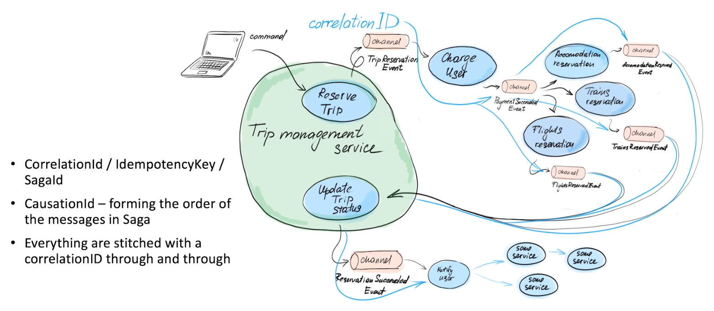
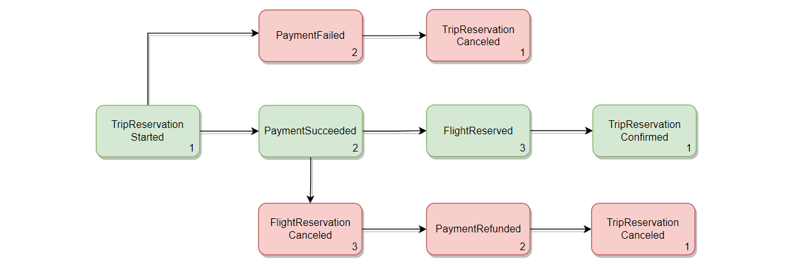
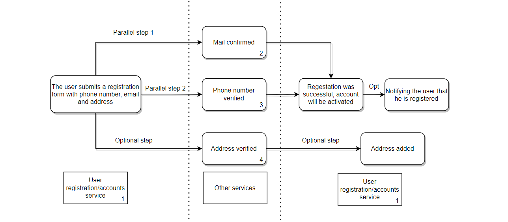
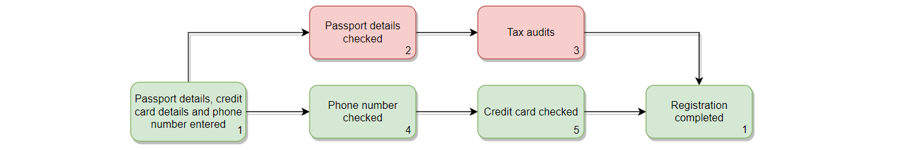

# **Пример использования реализации паттерна Сага**

## **Введение в Саги**

Один из недостатков микросервиской архитектуры связан с реализацией транзакций, охватывающих несколько сервисов. Так, если в монолитной архитектуре функциональность *ACID*-транзакций полностью обеспечивается СУБД, то в микросервисной архитектуре, при использовании модели *“Database per service”*, необходимо использовать более продуманный механизм работы с транзакциями.

И паттерн Сага – как способ организации транзакций в распределённой системе, является хорошим решением в такой ситуации. Само определение Саги звучит так – *последовательность локальных транзакций, которые координируются посредством асинхронных сообщений.* Т.е. каждый сервис, после выполнения своей части распределённой транзакции и фиксации этого в своей локальной базе данных, публикует событие, на основе которого действуют следующие участники Саги.

Если в *ACID*-транзакциях, в случае неудачи, для обеспечения атомарности, будет автоматически выполнена команда *rollback*, то при использовании паттерна Сага для этого нужно написать соответствующие компенсирующие транзакции, которые должны откатить уже сделанные изменения. Далее это будет подробнее рассмотрено на примерах.

Паттерн Сага можно реализовать двумя способами – *оркестрационным* и *хореографическим*. В реализации библиотеки используется хореографический подход – это когда не предусматривается центрального координатора, который выдает участникам команды, вместо этого участники подписываются на события друг друга и реагируют соответствующим образом. Также хореографическую Сагу можно назвать динамической, потому что в ней нет централизованного места, где можно посмотреть, какие сервисы являются участниками какой-то распределённой транзакции, а также потому что сама Сага может постоянно меняться.

## **Реализация Саги в библиотеке**

Теперь можно посмотреть, как это всё реализовано в библиотеке.  
Взаимодейсвие с Сагами выполняются с использованием `SagaManager`. По умолчанию все инструменты для взаимодействия с Сагами включены, но если вы хотите сделать свою реализацию, то в конфигурации можно выключить встроенную реализацию паттерна Сага: `event.sourcing.sagas-enabled=false`.

Для того, чтобы запустить Cагу нужно создать первый шаг Саги. Сделать это можно с помощью вызова метод `launchSaga(sagaName, stepName)` у `SagaManager`, передав `sagaName` - название этого процесса и `stepName` - название текущего шага. И после выполнения этого метода получить `SagaContext` - результат выполнения шага Саги и передать его при обновлении агрегата.
```kotlin
//Инициализация SagaContext через SagaManager
val sagaContext = sagaManager
    //Инициализация первого шага, sagaName="SAGA_EXAMPLE", stepName="First step"
    .launchSaga("SAGA_EXAMPLE", "First step")
    .sagaContext //Получить инициализированный sagaContext

//Передать SagaContext в метод создания/обновления аггрегата 
//В результате он будет сохранён в ивенте
val event = someEsService.create(sagaContext) {
    it.someMethod(params...)
}
//or
val event = someEsService.update(aggregateId, sagaContext) {
    it.someMethod(params...)
}
```
Внутри `SagaManager` происходит создание `SagaContext` – класса, который включает в себя Map `ctx`, в которой ключ - `sagaName`, а значение - метаданные о последнем шаге. В эти метаданные входят:
- `stepName`, который, как и `sagaName`, задаётся пользователем
- `sagaStepId` – идентификатор шага Саги
- `sagaInstanceId` – идентификатор самой Саги, который будет общим для одной конкретной распределённой транзакции
- `prevStepsIds` – индетификаторы предыдущих шагов Саги

`SagaContext` передаётся вместе с ивентом, на который подписывается следующий сервис в цепочке исполнения Саги. В этом сервисе можно извлечь метаданные и продолжить выполнение Саги.  
Делается это всё также через `SagaManager` вызовом метода `withContextGiven(sagaContext)`, а затем `performSagaStep`, который принимает такие же параметры, как и `launchSaga`:
```kotlin
val sagaContext = sagaManager
    .withContextGiven(event.sagaContext) //Извлечь метаданные из прошлого ивента
    .performSagaStep("SAGA_EXAMPLE", "Second step")
    .sagaContext
```
Для того чтобы можно было отследить какое событие следовало за каким, `SagaContext` включает в себя `prevStepsIds/correlationId` – идентификаторы предыдущих или одного предыдущего шага Саги.  
Следующая картинка примерно демонстрирует, как эти метаданные передаются от одного сервиса к другому.  


На код, который сделан по этой картинке можно посмотреть _[здесь](https://github.com/MaxZhukoff/saga-examples/tree/master/simple-saga-demo)_. _Но там это немного упрощено._  
Вот как выглядит по ивентам сценарии выполнения Саги в этом примере:



Успешный сценарий выделен зелёным цветом, неудачный – красным. Если одна из транзакций Саги завершилась неудачей, то необходимо запустить логику **компенсирующих** транзакций для сохранения согласованности в системе.

В библиотеке компенсирующие транзакции задаются также, как и обычные. Т.е. в случае ошибки, необходимо создать ивент, на основе которого будут действовать сервисы, которые были предыдущими в цепочке транзакций.

Для примера рассмотрим, что будет происходить, после того, как в сервисе `"flights"` произойдёт ошибка.  
Во-первых, будет создан ивент _`FlightReservationCanceledEvent`_. После этого отработает подписчик сервиса `"payment"` - [_`PaymentFlightSubscriber`_](https://github.com/MaxZhukoff/saga-examples/blob/master/simple-saga-demo/src/main/kotlin/ru/quipy/saga/simple/payment/subscribers/PaymentFlightSubscriber.kt), который откатит изменения сделанные ранее в этом сервисе. Далее всё вернётся в сервис, который инициировал данную Сагу, который констатирует факт неудачи всего процесса.  
Т.е. вы, как пользователь, полностью сами выстраиваете необходимый бизнес-процесс, включая логику _компенсирующих транзакций_.

### **_Параллельные процессы_**

Если в вашей бизнес логике необходимо, чтобы Сага исполнялась не только последовательно, а ещё и **параллельно**, т.е. когда для продолжения какого-то шага необходимо дождаться завершения несколько предыдущих, то вы можете передать в метод `witchContextGiven()` несколько `sagaContext` путём их складывания через опрератор **"+"**. Пример с параллельными шагами Саги можно посмотреть по этой _[ссылке](https://github.com/MaxZhukoff/saga-examples/tree/master/aggregation-saga-demo)_.  
Вот как выглядит сценарий выполнения этой Саги:  


В примере, необходимо дождаться двух ивентов - `Service2ProcessedEvent` и `Service3ProcessedEvent` в сервисе аккаунтов(`service1`). Один из способов сделать это - создать проекцию/view для сохранения ивентов. [Здесь](https://github.com/MaxZhukoff/saga-examples/blob/master/aggregation-saga-demo/src/main/kotlin/ru/quipy/saga/aggregation/service1/subscribers/Service2Service3Subscriber.kt) создаётся проекция `aggregation-example`, у которой id – это id Саги. В ней содержится некоторая информация из двух ивентов, которая необходима для продолжения Саги. Когда приходит один из ивентов, то проверяется, существует ли проекция с таким id Саги, если нет, то создаётся новая проекция и сохраняется информация о первом ивенте. Но в случае, когда проекция уже существует, то на основе данных из этой проекции продолжается выполнение Саги.  
Вот как выглядит создание контекса на основе двух предыдущих `sagaContext`:
```kotlin
val sagaContext = sagaManager
    .withContextGiven(prevSagaContext_1 + prevSagaContext_2)
    .performSagaStep("SAGA_EXAMPLE", "finish saga")
    .sagaContext
```
У такого ивента, который был создан на основе двух предыдущих шагов, в `prevStepsIds`, соответственно, будет два id шагов Саги.

#### **_Вложенные Саги_**

В `SagaContext` не случайно есть map `ctx`. С помощью этого можно создавать **вложеные Саги**.
Если вам необходимо обособить несколько шагов внутри одной Саги, т.е. создать **вложенную Сагу**, то вы можете сделать это следующим образом, как в этом _[примере](https://github.com/MaxZhukoff/saga-examples/tree/master/nested-saga-demo)_.  
Вот как выглядит сценарий выполнения Саги для этого примера:  


В данном случае вложенная Сага является также и параллельной, но это необязательное условие. Суть в том, чтобы внутри какого-то большого бизнес-процесса выделить подпроцессы.  
Здесь основная Сага будет включать в себя все шаги, но во вложенной будет содержаться только два шага, выделенных красным цветом.  
Создание вложенной Саги `NESTED_SAGA_EXAMPLE` и параллельное продолжение основной `SAGA_EXAMPLE` происходит в [`Service2`](https://github.com/MaxZhukoff/saga-examples/blob/master/nested-saga-demo/src/main/kotlin/ru/quipy/nested/service2/subscribers/Service1Subscriber.kt). В [`Service3`](https://github.com/MaxZhukoff/saga-examples/blob/master/nested-saga-demo/src/main/kotlin/ru/quipy/nested/service3/subscribers/Service2Subscriber.kt) идёт следующий шаг.

### **_Упрощенный вариант_**

В библиотеке есть возможность использовать более **упрощённую схему** использования паттерна Сага, без `SagaManager`. Для этого в `SagaContext`, помимо `ctx`, содержится ещё три значения:
- `correlationId` – означает то же самое, что и `sagaInstanceId` из `ctx`
- `currentEventId` – означает то же самое, что и `sagaStepId` из `ctx`
- `causationId` – означает то же самое, что и `prevStepsIds` из `ctx`, но может содержать только одно значение

При искользовании такого варианта у Саги и её шагов не будет названий. А также нельзя будет создавать вложенные Саги и параллельные шаги.
Для этого при обновлении агрегата достаточно передать `SagaContext` предыдущего ивента. Пример такой Саги можно посмотреть _[здесь](https://github.com/MaxZhukoff/saga-examples/tree/master/default-saga-demo "Это переделанный первый пример")_.

## **Проекции по Сагам**

Сейчас, чтобы отследить весь процесс исполнения какой-то Саги, нужно обращаться к каждому сервису-участнику. Но с помощью проекций можно собрать информацию по Сагам в одном месте. Это позволит мониторить состояние Саг, получить все шаги по `sagaInstanceId`, отследить время, которое потребовалось для обработки каждого шага, а также узнать, в каком сервисе произошла ошибка.

Для того, чтобы разобраться, как стояться проекции, необходимо немного понимать, как работают некоторые процессы внутри библиотеки, связанные с Сагами.

Для локального хранения информации о Сагах, используется агрегат `SagaStepAggregate`.  
У этого агрегата есть 4 ивента:
- `SagaStepLaunchedEvent` – информирует о том, что был **инициирован** первый шаг Саги, но он ещё не был обработан
- `SagaStepInitiatedEvent` – информирует о том, что был **инициирован** последующий шаг Саги, но он ещё не был обработан
- `SagaStepProcessedEvent` – информирует о том, что шаг Саги был **обработан** и сохранён в `EventStore`
- `DefaultSagaProcessedEvent` – информирует о том, что шаг Саги по умолчанию был обработан

Все эти события сохраняются в таблицу `sagas`. В каждом сервисе/ограниченном контексте будет своя, отдельная такая таблица.

Также в библиотеке есть отдельный *event-stream* - `SagaEventStream` для работы с Сагами. Он необходим, чтобы отслеживать, что событие Саги было успешно обработано и записано в БД. Этот *event-stream* подписывается на события **всех** агрегатов и ищет в них *мета-информацию*, связанную с Сагами. После этого передаёт команды в `SagaStepAggregate`, которые публикуют ивенты `SagaStepProcessedEvent` или `DefaultSagaProcessedEvent`.

Так, с помощью `SagaManager` фиксируется факт начала обработки шага Саги, а с помощью `SagaEventStream` - то, когда событие было уже успешно обработано.

Важно отметить, что для упрощённого варианта использования Саг ивенты `SagaStepLaunchedEvent` и `SagaStepInitiatedEvent` не публикуются, т.к. не используется `SagaManager`. Вместо этого публикуется только один ивент - `DefaultSagaProcessedEvent`.

Для отслеживания Саг в библиотеке уже есть готовый сервис из модуля `tiny-event-sourcing-sagas-projections`.  
Этот сервис подписывается на события локальных агрегатов саг `SagaStepAggregate` и создаёт таблицы `sagas-projections` для расширенного варианта и `sagas-default-projections` для упрощённого. С помощью этого сервиса можно в одном месте отследить все Саги, которые есть в системе.

В проекции для каждой Саги создаётся свой документ, где отображается `sagaInstanceId`, `sagaName` и все шаги этой Саги - `sagaSteps`. В `sagaSteps` помимо `sagaStepId`, `prevStepsId` и `stepName` есть время, когда начался процесс обработки шага, и когда он уже был успешно завершён, а также название ивента, к которому относиться этот шаг. Всю последовательность шагов можно отследить по `sagaStepId` и `prevStepsId`. Также там реализована простая сортировка по `sagaStepId` и `prevStepsId`.

Для создания своего сервиса для отслеживания Саг нужно, во-первых, определить, что будет сохраняться в проекциях.  
(Везде используется *String* для более удобного представления этих данных в БД, но можно так не делать)
```kotlin
@Document("sagas-projections")
data class Saga(
    @Id
    val sagaInstanceId: String, //UUID
    val sagaName: String?,
    val sagaSteps: MutableList<SagaStep> = mutableListOf()
)

data class SagaStep(
    val stepName: String,
    val sagaStepId: String, //UUID
    val prevStepsId: Set<String> = setOf(), //UUID
    //Время, когда начался процесс обработки шага(в миллисекундах)
    val initiatedAt: String, //Long
    //Время, когда шаг уже был обработан и записан в БД(в миллисекундах)
    var processedAt: String? = null, //Long
    var eventName: String? = null
)
```
Во-вторых, создать подписчика для ивентов из `SagaStepAggregate`. [В начале главы есть список и описания всех ивентов](#Проекции-по-Сагам).  И в подписчике сохранять необходимую информацию.

Пример для `SagaStepLaunchedEvent`:
```kotlin
subscriptionsManager.createSubscriber(SagaStepAggregate::class, "local-sagas::sagas-projections") {
        `when`(SagaStepLaunchedEvent::class) { event ->
            val sagaName = event.sagaName
            val stepId = event.sagaStepId.toString()
            val stepName = event.stepName

            val saga = Saga(event.sagaInstanceId.toString(), sagaName)

            val newStep = SagaStep(
                stepName,
                stepId,
                event.prevSteps.map { it.toString() }.toSet(),
                event.createdAt.toString()
            )
            insertNextStep(saga.sagaSteps, newStep)

            sagaProjectionsRepository.save(saga)
        }
    }
}
```
Здесь из ивента извлекается информация о самой Саги и шаге Саги и сохраняется в БД.  
Для `SagaStepInitiatedEvent` поведение будет практически таким же.  
Для `SagaStepProcessedEvent` достаточно обновить уже сохранённый шаг Саги:
```kotlin
`when`(SagaStepProcessedEvent::class) { event ->
    //Находим Сагу, шаг для которой нужно обновить
    val saga = sagaProjectionsRepository.findById(event.sagaInstanceId.toString()).get()

    //Извлекаем информацию из ивента
    val sagaName = event.sagaName
    val stepId = event.sagaStepId.toString()
    val stepName = event.stepName

    //Обновляем шаг Саги
    val sagaStep = saga.sagaSteps.find { it.sagaStepId == stepId }
    sagaStep?.processedAt = event.createdAt.toString()
    sagaStep?.eventName = event.eventName
}
```